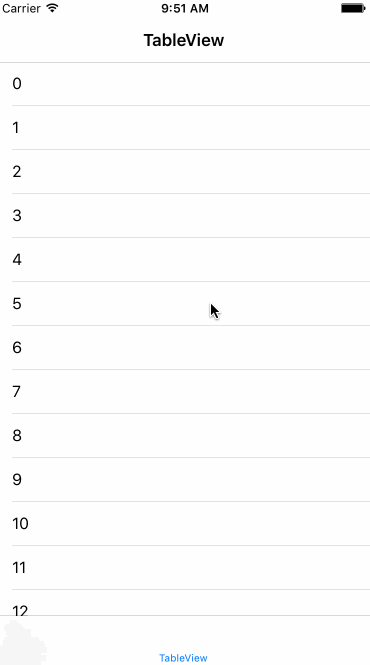

# LPScrollFullScreen-swift

scroll to full screen with 2 line codes only and rewrite with Swift

# Additional

Objective C version is [here](https://github.com/litt1e-p/LPScrollFullScreen)
Swift3 version is coming soon

# Installation

```swift
pod 'LPScrollFullScreen-swift', '~> 1.0.1'
```

```swift
var scrollProxy: LPScrollFullScreen?
/**  in tableView */
scrollProxy = LPScrollFullScreen(forwardTarget: self)
self.tableView.delegate = scrollProxy!
/**  in webView */
scrollProxy = LPScrollFullScreen(forwardTarget: self)
webView?.scrollView.delegate = scrollProxy
```
# Screenshot



# Release Notes

- 1.0.1

`fix bug of swift dynamic forward target`

- 1.0.0

`first release version`

# License

MIT


